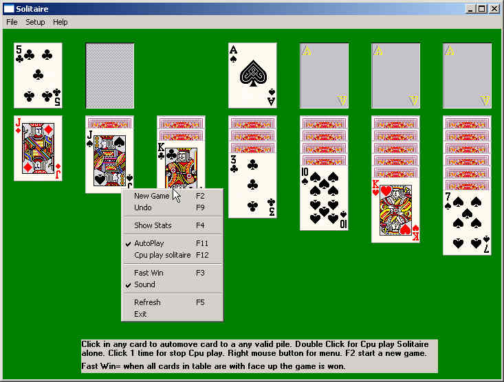



## Solitaire 1\.0

### Description

Card game Solitaire 1.0. Features are: AutoPlay, ClickAuto, Animated cards, Cpu play Solitaire alone, Auto draw cards when user resizes form, Setup speed of animated cards,Etc...

This code maybe have some bugs, but i don´t time for complete this game anymore.

The code have some comments, sorry for this. i think is easy to understand this code.

If u like this, please send me a postcard of your city.
 
### More Info
 

             |
---                |---
**Submitted On**   |2002-10-21 04:05:56
**By**             |[Paulo Matoso](https://github.com/Planet-Source-Code/PSCIndex/blob/master/ByAuthor/paulo-matoso.md)
**Level**          |Intermediate
**User Rating**    |4.9 (44 globes from 9 users)
**Compatibility**  |VB 6\.0
**Category**       |[Games](https://github.com/Planet-Source-Code/PSCIndex/blob/master/ByCategory/games__1-38.md)
**World**          |[Visual Basic](https://github.com/Planet-Source-Code/PSCIndex/blob/master/ByWorld/visual-basic.md)
**Archive File**   |[Solitaire\_14853710222002\.zip](https://github.com/Planet-Source-Code/paulo-matoso-solitaire-1-0__1-40052/archive/master.zip)

